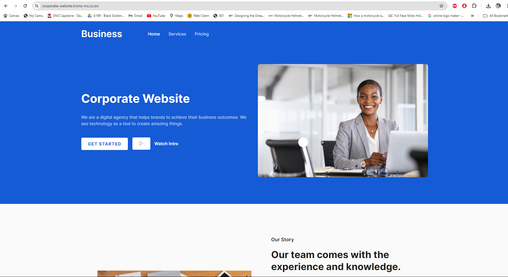
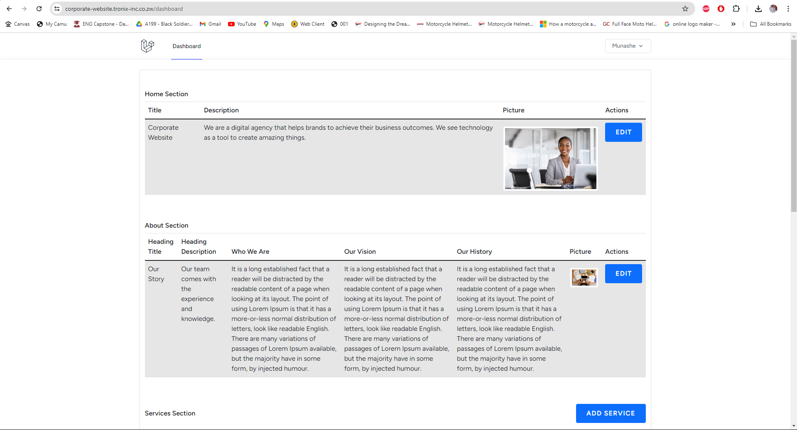

# CorporateWebsite


CorporateWebsite is a web application designed for Property Book Job Assessment.

## Table of Contents
1. [Installation](#installation)
2. [Configuration](#configuration)
3. [Database Setup](#database-setup)
4. [Creating a User](#creating-a-user)
5. [Hosted Solution](#hosted-solution)
6. [Default User Credentials](#default-user-credentials)

## Installation

Follow these steps to set up the project on your local machine:

1. **Clone the repository:**
    ```bash
    git clone https://github.com/Nyazenga/CorporateWebsite.git
    ```

2. **Navigate to the project directory:**
    ```bash
    cd CorporateWebsite
    ```

3. **Install Dependencies:**
    ```bash
    composer install
    npm install
    npm run dev
    ```

## Configuration

1. **Set up the environment variables:**

    Copy `.env.example` to `.env`:
    ```bash
    cp .env.example .env
    ```

2. **Configure the database settings in the `.env` file:**
    ```
    DB_CONNECTION=mysql
    DB_HOST=127.0.0.1
    DB_PORT=3306
    DB_DATABASE=corporate_website
    DB_USERNAME=root
    DB_PASSWORD=
    ```

## Database Setup

1. **Ensure you have MySQL installed and running.**

2. **Create a new database named `corporate_website` in MySQL.**

3. **Migrate and seed the database with initial data:**
    ```bash
    php artisan migrate
    php artisan db:seed --class=HomeSeeder
    php artisan db:seed --class=AboutSeeder
    php artisan db:seed --class=ServiceSeeder
    php artisan db:seed --class=PricingSeeder
    php artisan db:seed --class=FooterSeeder
    ```

## Creating a User

1. **Use `php artisan tinker` to create a new user:**
    ```bash
    php artisan tinker
    ```

2. **In the tinker shell, run the following commands:**
    ```php
    $user = new App\Models\User;
    $user->name = 'Munashe';
    $user->email = 'nyazengamd@gmail.com';
    $user->password = Hash::make('12345678'); // Replace '12345678' with your desired password
    $user->save();
    exit
    ```

## Hosted Solution

An already hosted solution is available at:

- **Website:** [Corporate Website](https://corporate-website.tronix-inc.co.zw/)



- **Admin Panel:** [Dashboard](https://corporate-website.tronix-inc.co.zw/dashboard)



## Default User Credentials

For development purposes, a default user is seeded with the following credentials:

- **Email:** nyazengamd@gmail.com
- **Password:** 12345678

